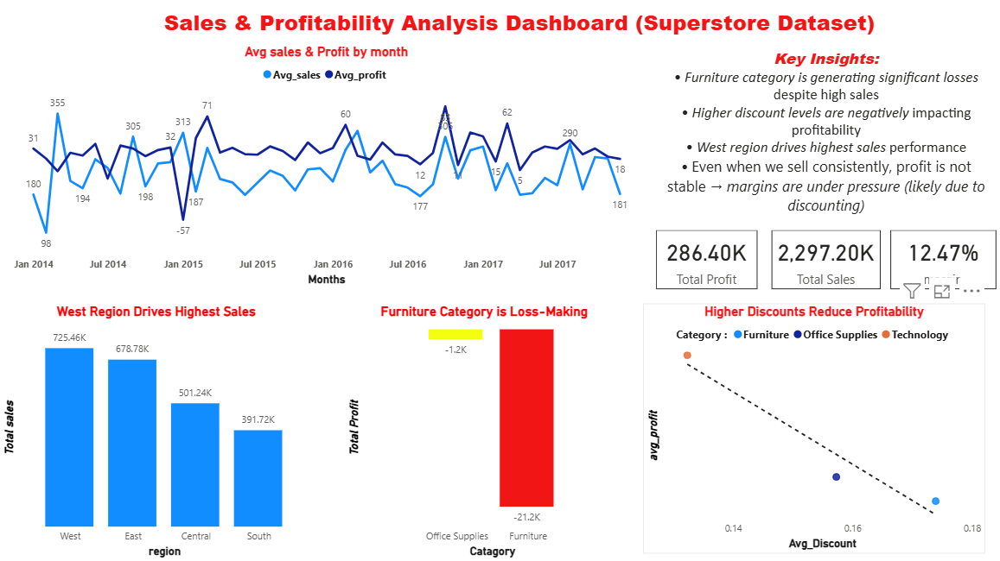

# Sales & Profitability Analysis (Power BI + SQL)

## Overview
This project analyzes sales performance, profitability, and discount impact using the Superstore dataset.  
The data was first explored and transformed using SQL, and then visualized in Power BI.

## Tools Used
- SQL (Data extraction & transformation)
- Power BI (Dashboard & visualization)

## Workflow
- Used SQL to clean and analyze raw sales data
- Created aggregated tables (sales, profit, discount analysis)
- Imported processed data into Power BI
- Built interactive dashboard for business insights

## Key Insights
- Furniture category is generating losses despite strong sales
- Higher discount levels negatively impact profitability
- West region drives the highest sales performance
- Several products consistently generate losses

## Files Included
- sales dataset.pbix → Power BI dashboard  
- sales_data.sql → SQL queries used

## Dashboard Preview 

## About
This project demonstrates end-to-end data analysis using SQL and Power BI, including data transformation, visualization, and insight generation.
